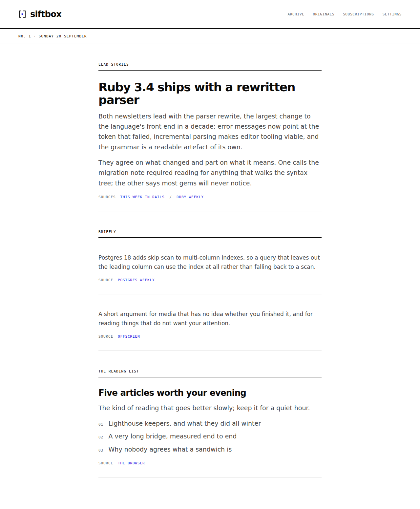

# siftbox

siftbox gives your subscriptions one dedicated address, follows blogs by RSS
beside them, and reads everything that arrived into a single edition each
morning: what the stories were, who covered them, and where they disagree.
Every line links to the original, and the originals stay whole in an archive
behind it. It serves one reader — you — and it runs as one Rails app in one
container on one SQLite volume.



[](https://github.com/chrisjgilbert/siftbox/actions/workflows/ci.yml)

## How it works

Mail arrives at one address on an inbound domain you point at Postmark, which
posts it to Action Mailbox, which stores it. Blogs are polled hourly over RSS
and their posts land beside the mail. At 07:00 a job sends everything that
arrived since the last edition to Claude, which writes the stories. Each
story is stored with the newsletters and posts it was written from, and the
page prints those sources under it as links into the archive, so a claim can
always be taken back to the thing that made it.

Nothing an outsider wrote is ever rendered as markup on an app page: the
edition is the editor's words through ordinary escaping, and a newsletter is
shown as it arrived only inside a sandboxed frame that can reach nothing of
this app's. The images a newsletter hotlinks are fetched once at ingest and
re-hosted, so opening one makes no request to the sender — and because those
URLs come from whoever sent the mail, `Download::Destination` resolves each
one, refuses any address off the public internet, and asks again at every
redirect. `docs/operating.md` has the mechanism behind each of those.

## Run it locally

From a fresh clone, with Ruby installed:

```bash
export SIFTBOX_READER_EMAIL=you@example.com
export SIFTBOX_READER_PASSWORD=a-long-enough-password
bin/setup --skip-server     # gems, database, and the only account from those two
bin/rails sample_data:load  # development only: five newsletters and an edition
bin/dev                     # the server and the job worker
```

`--skip-server` matters: without it `bin/setup` ends by starting the server
and the two commands after it never run.

Then sign in at <http://localhost:3000> with the address and password you
exported, and `/` is the sample edition. Signed out, `/` is the public page:
what siftbox is, a morning's edition and a link to this repository. It takes
nothing from a visitor.

## What it needs from outside

- **Postmark**, for a deployment — required. It receives mail at the inbound
  address and it sends the password-reset mail, which is the only way back
  into an app with no sign-up flow. Both ends of it are two settings in
  `config/environments/production.rb` — the Action Mailbox ingress and the
  SMTP host — and nothing else in the app knows which provider it is talking
  to, so another Action Mailbox ingress is a small change. Locally you need
  none of it: the Action Mailbox conductor takes a raw message straight in.
- **An Anthropic API key**, for editions — optional. Without it the morning
  job raises once in the worker log and nothing else changes: the archive,
  subscriptions and blogs all work, and the editions page goes on saying the
  first one is written at 07:00. Budget roughly $0.45 a day at the assumed
  volume — arithmetic over an assumed input size rather than a measurement,
  as `docs/briefing-followups.md` says.
- **Honeybadger**, for error reporting — optional. Without a key the gem logs
  that it is missing and errors reach the container log only.

## Deploying

One container and one volume, with Kamal. The volume holds the four SQLite
databases and the Active Storage blobs together, so that single path is the
whole of this app's state and backing it up backs up everything. There is no
database server to run. `docs/deploying.md` is the runbook, in the order the
steps depend on each other; `docs/operating.md` is what to read alongside it —
every environment variable and what a missing one costs, the host egress rule
this app cannot install for itself, and the reasoning behind the decisions a
change is most likely to undo.

## How it is built

siftbox was built with Claude Code, and `CLAUDE.md` and the short files in
`.claude/rules/` are how it is directed — style, where domain logic lives, and
a testing rule that says write the test first. `docs/` holds the design and
planning documents the features were built from, which are the honest record
of what was decided and what it cost. `CONTRIBUTING.md` says what a pull
request has to clear; `SECURITY.md` says where a vulnerability report goes.

## Support

**[SUPPORT EXPECTATIONS — not yet set.]**

One sentence, the owner's to write, saying what a stranger should expect:
whether questions are read, whether they are answered, and how quickly. It is
the only line in this file that promises anything, so nobody else can write
it. Security reports are separate and go through `SECURITY.md`, which already
states a reply window.

## Licence

MIT. See `LICENSE`.
